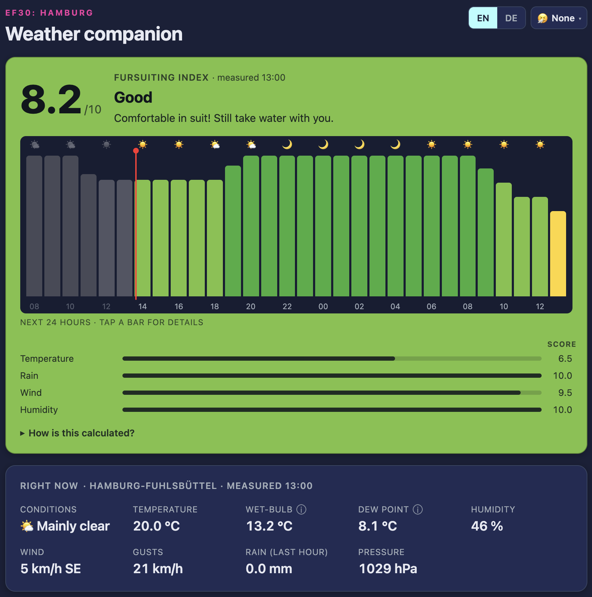

# EurofurenceWeather

Eurofurence Weather is an easy to use tool, that allows convention goers at EF in Hamburg to quickly assess the ability to hang outside either with or without suit.

[](https://ko-fi.com/B0B6BCXY7)


My friends and I have always looked for an easy method to answer the following the question: 
**can I go outside in suit right now?**

I've built this website on [DWD OpenData](https://opendata.dwd.de). It uses MOS-MIX, official weather warnings by DWD, pollen data, current Radar images and creates ICON-D2 maps for better assesment. It features a wide range of features:


- **Fursuiting Index**: a 0–10 score for how comfortable and safe suiting is, with one
  bar per hour and a weather icon above each so you can see how the day builds.
  **Click any bar** for the conditions behind it
- **Weather overview and warnings**: current conditions, official DWD warnings, and a
  five-day outlook where **every day gets its own hour-by-hour chart** plus its best and
  worst hour, because during the con every hour matters
- **Rain radar**: the DWD radar composite on an interactive dark map
- **Model maps**: ICON-D2 decoded straight from DWD's GRIB2 files: cloud cover with
  the rain rate painted on top, 2 m temperature, and 10 m wind with direction arrows.
  One button per forecast hour out to +48, or press play and watch them run
- **Pollen**: pick your allergy and the model card grows a tab for it: the DWD ICON-ART
  forecast for hazel, alder, birch, grasses or ragweed, six days ahead
- **Works offline**: the page and the last forecast are cached, so it still opens
  on a congested convention network and says how old the numbers are
- **ConOps display** at `/display`: a full-screen board for the info desk
- **Public API** at `/api/v1`: versioned, documented, open (see [API](#api))
- **EN/DE** language support.
- **Unit conversion** if you prefer Fahrenheit or a different clock type.

## ConOps display

`/display` is a self-refreshing board sized for a screen at the ConOps desk.
Warnings are marked directly on the hourly bars rather than in a tile of their own. Open it fullscreen (F11) and leave it.

By default it is a plain monitor: nothing on it responds to a click, because most boards
are a screen on a wall with no input device near them.

Add `?touch` — `/display?touch` — on a screen that really is a touchscreen. Tapping a bar
then switches the conditions strip to that hour, which is handy at the desk when someone
asks about tonight. It says so in the heading and goes back to live conditions by itself
after 90 seconds, so an unattended board never sits on a forecast.

It fits a 1080p landscape screen exactly and falls back to a single column on portrait or
tablet displays. Might not work in older versions of browsers.

---

## Quick start

```bash
docker compose up -d
```

Open <http://localhost:8000>.

Without Docker:

```bash
pip install -r requirements.txt
uvicorn app.main:app --host 0.0.0.0 --port 8000
```

## Data sources

Everything comes from DWD, which publishes free of charge under the
[GeoNutzV](https://www.dwd.de/DE/service/copyright/copyright_node.html) terms.

| Source | What it provides | Updates |
|---|---|---|
| [MOSMIX_L](https://opendata.dwd.de/weather/local_forecasts/mos/MOSMIX_L/single_stations/) | Hourly point forecast, ~10 days, per station | 4x/day |
| [POI reports](https://opendata.dwd.de/weather/weather_reports/poi/) | Surface observations, current plus the last ~24 h | hourly |
| [WarnWetter](https://www.dwd.de/DWD/warnungen/warnapp/json/warnings.json) | Official warnings per Warncell | ~every few minutes |
| [maps.dwd.de GeoServer](https://maps.dwd.de/geoserver/dwd/wms) | Radar composite + warning areas (WMS) | every 5 min |
| [ICON-D2 GRIB2](https://opendata.dwd.de/weather/nwp/icon-d2/grib/) | Cloud cover, temperature, wind on a 2 km grid | every 3 h |
| [ICON-ART pollen NetCDF](https://opendata.dwd.de/climate_environment/health/forecasts/pollen/) | Daily mean pollen concentration, 6 days, ~6.5 km grid. **season only** | daily, ~03:35 UTC |

## The Fursuiting Index

The index rates suiting conditions from 0 (stay out of suit) to 10 (perfect). Four
weighted sub-scores feed it:

| Factor | Weight | Why it matters |
|---|---|---|
| Temperature | 50 % | **Wet-bulb temperature** plus a sun load. A suit blocks the sweat evaporation your body relies on, so this dominates. The bands sit on the [heat index](https://de.wikipedia.org/wiki/Hitzeindex) steps — 18.5 °C effective wet-bulb is where its *caution* begins, 24 °C *extreme caution*, 27 °C *danger* — with the suit in the sun load added before them rather than in tighter thresholds. |
| Rain | 30 % | Rain rate blended with probability, plus a penalty for ground still wet from the last 24 h. Steep at the bottom: a suit soaks rain up and stays wet, so 0.3 mm in an hour is already a problem. |
| Wind | 12 % | U-shaped: dead calm turns a suit into an oven, gales are dangerous. Best around 1–3 m/s. |
| Humidity | 8 % | Dew point. |

**Heat and rain are ceilings, not just terms in the mean**, so a good sub-score can never
mask a bad hour: the index is the *lowest* of the weighted mean, the temperature score and
the rain score. Without this, "it isn't raining" (10/10) would drag a dangerously hot hour
up into the middle of the scale — and, the other way round, rain is only 30 % of the mean,
so on an otherwise perfect afternoon the worst it could do was take three points off. An
hour that ends with a suit too wet to wear is not a three-point problem.

There is nothing else to read: when heat or rain decides an hour, the index simply equals
that bar in the breakdown. The chance of rain is folded into the rain score as its square
root, not raw: being caught out in suit is far worse than a dry hour is good, and it is a
call you make an hour ahead.

Warnings are shown **on the hourly bars**, over the hours they cover. A
*Vorabinformation*. DWD flagging possible severe weather before it is certain enough to
warn on, is drawn with **red diagonal hatching** so it is never mistaken for a warning in
force. On the public site the wording collapses to a single line that expands on click;
the board shows the marks only.

Overlapping warnings are packed into as few rows as they need, and the chart reserves
exactly that much space, the row count is handed to the stylesheet, so a fourth warning
grows the panel instead of landing across the bars. A band too narrow to hold its wording
(a one-hour warning is a sliver of a 24-hour chart) keeps the marker and moves its label
out to whichever side has room.

## Declaration

AI decliration: AI was used in this project to assist in the building process.

## Licence

MIT — see [LICENSE](LICENSE). Weather data © Deutscher Wetterdienst.
